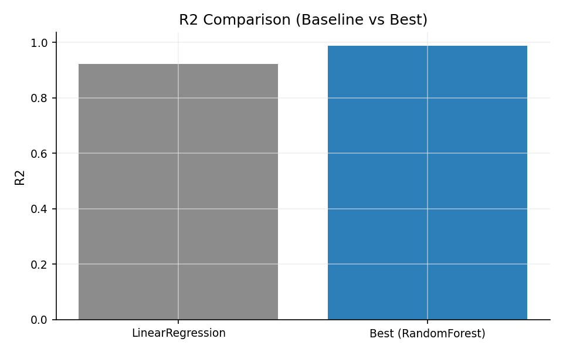
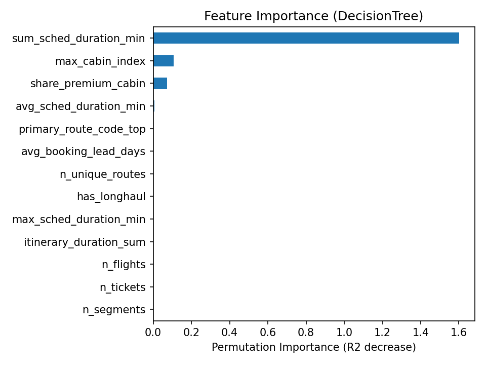

# Airline Revenue Analytics – Dual-Track Entry

**English | [中文](README.zh.md)**

This repo provides a **primary deliverable** and an **optional appendix**:
- **Primary: Booking-level pipeline (recommended)** — main deliverable for operational/business summary.
- **Segment pipeline: feature building / optional appendix** — segment-level exploration only.

> The database is not committed; see Data Setup.

## Core Results (Booking Pipeline)
| Model | Role | R2 (log) | RMSE (log) | MAE (log) |
| --- | --- | --- | --- | --- |
| LinearRegression | Baseline | 0.921 | 0.242 | 0.182 |
| RandomForest | Best | 0.988 | 0.095 | 0.043 |
| DecisionTree | Comparator | 0.977 | 0.130 | 0.081 |

Conclusion: RandomForest clearly outperforms the linear baseline on log scale (R2 +0.067, RMSE -0.147, MAE -0.139), driven by nonlinear effects of itinerary duration and cabin/route complexity.

## Robustness Check (Route Hold-out)
| Split | R2 (log) | RMSE (log) | MAE (log) | Notes |
| --- | --- | --- | --- | --- |
| Random split (by `book_ref`) | 0.988 | 0.095 | 0.043 | RandomForest (best) |
| Route hold-out (unseen `primary_route_code`) | 0.966 | 0.149 | 0.077 | 91 routes held out (~30% rows) |

Interpretation: Only a small drop on route hold-out suggests the model is not just memorizing routes and still generalizes to unseen routes.

## Business Insights
- **Itinerary duration is the main price driver**: `sum_sched_duration_min` dominates importance, consistent with duration-based revenue management.
- **Cabin mix and trip complexity are actionable levers**: `share_premium_cabin` / `max_cabin_index` plus `n_tickets` / `n_flights` / `n_unique_routes` capture price structure for upsell and connection strategies.

## Validity / Leakage Controls
- **Split**: group-wise by `book_ref` to avoid leakage across train/test.
- **Features**: only schedule/cabin/route observables; no price fields as inputs.
- **Metric scale**: reported on `log_total_amount`; use `exp` to interpret real amounts.
- **High R2 note**: duration dominance is expected but monitored; leakage is prevented by feature design.

## Quickstart
1. `pip install -e .`
2. Download data (not in repo): `pip install kaggle` then `python scripts/fetch_data.py` (or place manually at `data/raw/airlines_db.sqlite`).
3. `python pipelines/run_booking.py`

Optional: `pip install -e .[parquet]` to enable parquet output, or pass `--no-parquet` to skip.

## Repo Structure
```
repo_root/
  README.md
  README.zh.md
  .gitignore
  pyproject.toml

  src/
    airline_revenue_analytics/
      __init__.py
      config.py
      io.py
      features/
        segment.py
        booking.py
      modeling/
        train.py
        eval.py
      viz/
        charts.py

  notebooks/
    booking/
    segment/

  pipelines/
    run_booking.py
    run_segment.py

  data/raw/                  # gitignored
  outputs/
    booking/
    segment/
```

## Primary vs Appendix
| Dimension | Booking pipeline (Primary) | Segment pipeline (Appendix) |
| --- | --- | --- |
| Granularity | Booking-level (aggregated) | Segment-level (single leg) |
| Target | `total_amount` / `log_total_amount` | `amount` (segment fare) |
| Features | Itinerary aggregates (counts/durations/routes) | Segment features (time/cabin/aircraft/route) |
| Models | Linear + Tree + RandomForest baselines | Linear + Tree baselines |
| Outputs | `outputs/booking/` | `outputs/segment/` |
| Use case | Business summary & interpretation | Feature engineering appendix |

> The two tracks use different definitions and are not directly comparable in absolute metrics.

## Reproducibility
- Target: `log_total_amount` (log of `total_amount`).
- Metrics: reported on log scale.
- Split: fixed random seed, grouped by `book_ref`.
- Randomness: `numpy/random=42`, `DecisionTree/RandomForest random_state=42`.

## Notebooks
- `notebooks/portfolio_report.ipynb`: read-only 3-minute summary built from `outputs/booking/*` (run `python pipelines/run_booking.py` first).
- `notebooks/booking/`: main narrative notebooks (recommended).
- `notebooks/segment/`: legacy segment notebooks (appendix).
- Notebook deps: `pip install -e .[notebook]` or `pip install -r requirements-notebook.txt`.
- Use `pip install -r requirements.txt` only when editable install is not available.

## Data Source & License
- Dataset: Airlines_DB (Kaggle `datalearn/airlines-db`).
- URL: https://www.kaggle.com/datasets/datalearn/airlines-db
- License/terms: follow the Kaggle dataset page and Kaggle API terms; data is not redistributed here.
- Processing: SQLite ingestion, basic cleaning (`\\N` -> NaN), feature engineering, and booking-level aggregation.

## Data Setup
- Data is not included; source is Kaggle `datalearn/airlines-db`.
- Recommended: `pip install kaggle` + `python scripts/fetch_data.py` (token at `~/.kaggle/kaggle.json`, `chmod 600`).
- Manual guide: `python scripts/fetch_data.py --manual`.
- Manual placement: `data/raw/airlines_db.sqlite`, or set `AIRLINE_DB_PATH=/path/to/airlines_db.sqlite`.

## Key Figures




## Core Metrics
- Full metrics: `outputs/booking/tables/metrics.csv`.

## Clean
- Clean caches before packaging: `scripts/clean_repo.sh`.

## License
- MIT (see `LICENSE`)
